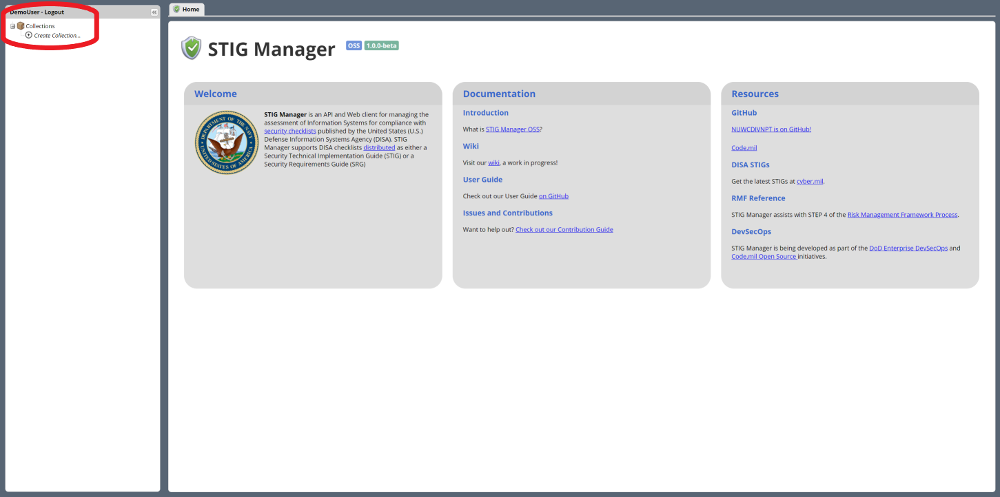
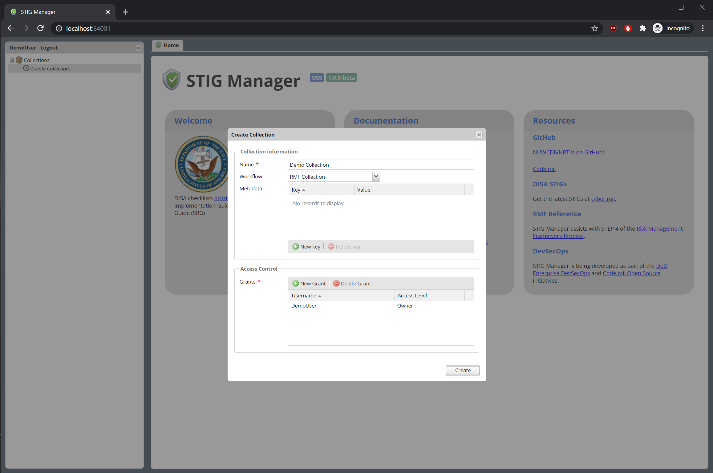
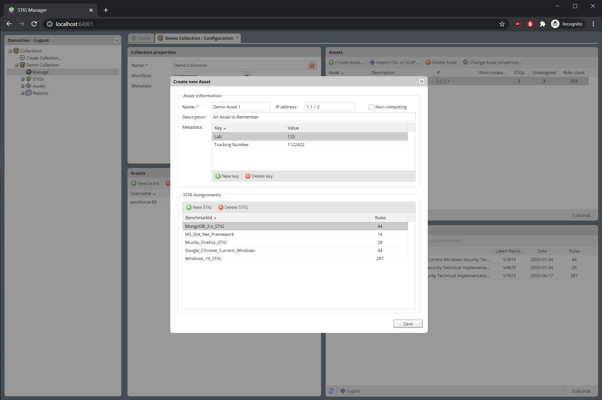
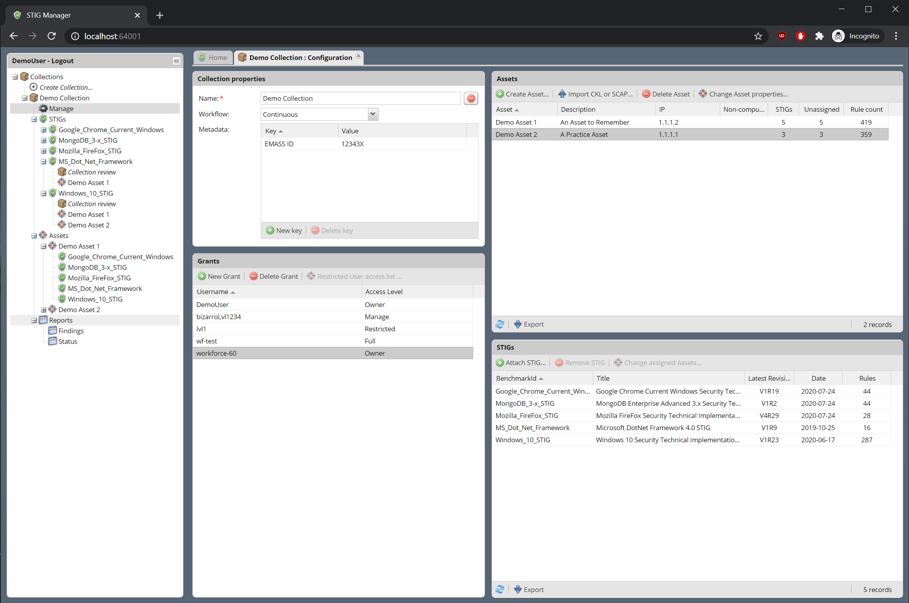

# STIGMan Quickstart USER Guide

## Create your first Collection

By default, most users will have the Collection Creator role, allowing them to create their own Collection of Assets and their STIGs, and to provide access to them to other users in the system.

1. After logging into the system, click the +Create Collection item in the Nav Tree on the left.

* You may have already been given access to some Collections in STIGMan, or you may not have the Collection Creator privilege. If your Nav Tree is already sufficiently populated, feel free to skip to the Evaluate Asset STIG Compliance section.

2. You will be prompted for your collection name, and some other info. Only a Collection name and Owner are required. (Your user is prepopulated as an owner.)  Click "Save" when finished.

## Create Assets in your Collection

1. From the Collection Management panel, use the "Create Asset..." button to create some sample assets. You can also assign them some STIGs from the New Asset popup.
2. Assets and their STIG assignments can also be created automatically by importing STIG Viewer .ckl or XCCDF files using the "Import CKL or SCAP..." button.

## Assign STIGs to Assets in your Collection
1. Add or remove STIG assignments by double-clicking on an Asset in the Collection Management screen, and making the desired changes in the Asset Pop-up. 
2. Alternately, STIG assignments can be made by by double-clicking on a STIG in the Collection Management screen. 
3. STIG Assignments can also be made automatically by importing STIG Viewer .ckl or XCCDF  files using the "Import CKL or SCAP..." button.

1. Grant other users access to your entire collection or just specific Asset/STIG combinations.
* The Assets you create a rx the STIGs you assign them are presented in the Collection Management panel as well as the Nav Tree entry for that collection  on the left.

## Give Users access to your Collection

1. Grant other users access to your entire collection or just specific Asset/STIG combinations.

 
 

 ## Evaluate Asset STIG compliance

 1. In the Nav Tree, expand Assets in the Collection you just created.

- Select an Asset to see an associated STIG.
- Select a STIG you assigned in Step X.
  - You will now be presented with the Evaluation panel fo that STIG on that Asset.
  - Select a rule to find the rule info int he panel next to it.
  - Manual Evaluations for this rule are performed int he bottom right panel
- Rule evaluations must include a Result and a Result comment in order to be submitted for review to the Collection owner (this may be you). Open findings also require an Action and Action comment to be submitted.
- The Resources panel in the top right presents other useful info, such as Evaluations you have performed for other assets with this Rule, as well as the history fo the evaluation.  You can drag and drop evaluations from Otehr Assets tot he Eval panel in the bottom right.
- (Perhaps “Owners” performing an evaluation can immediately acce[t their own Evals?)
Evaluations can also be imported, if they are in the .ckl format provided by STIG Viewer to the .xccdf format produced by the SCC tool and other STIG Evaluation tool. Import option is here: (pic). STIG and asset name must match.

“Review” a few rules for this asset, giving them an assortment of Results and Actions.
These evaluations are summarized and reported in the Reports node of the Nav Tree.
Findings present just the Open rule evaluations, and can be exported as a spreadsheet or a pseudo-POAM format.
Status presents an overall summary of evaluations, showing completion statuses and other info. 

Evaluate byAsset vs Evaluate by STIG.
STIG option will show you all your accessible assets that are also assigned this STIG, and let you evaluate them all in one summary view tab panel.
